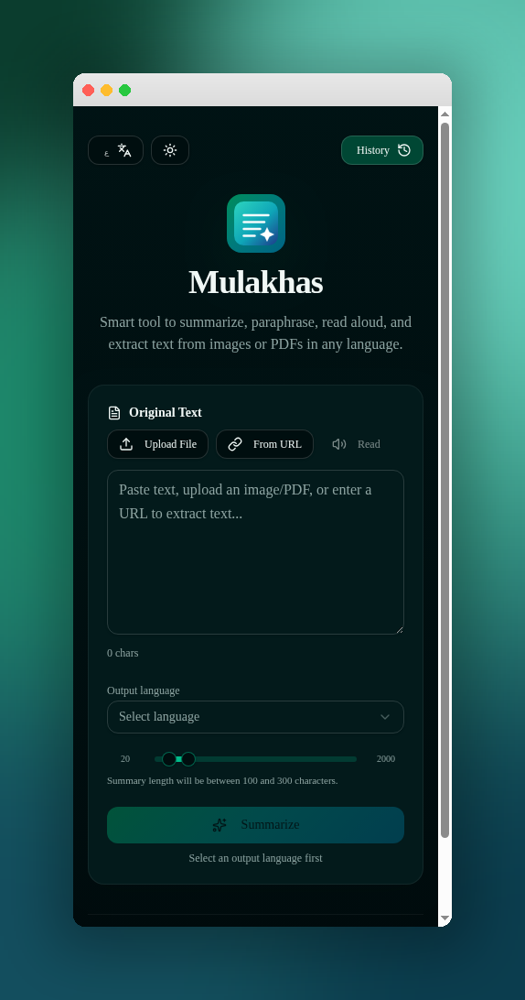
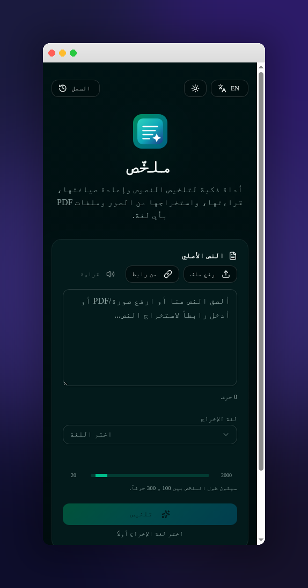

# ملخّص · Mulakhas

> Smart tool to **summarize**, **paraphrase**, **read aloud**, and **extract text** from images, PDFs, and URLs — in any language.

<p align="center">
  <a href="https://mulakhas.lovable.app"><strong>Live demo →</strong></a>
</p>

<p align="center">
  
  
</p>

---

## Highlights

- **AI summarization & rephrasing** in any output language, with a configurable summary length range (20 – 2000 characters).
- **OCR** — drop in an image or PDF (up to 5 MB) and pull the text out.
- **From URL** — paste a link to a remote image or PDF; the server fetches and extracts it.
- **Read aloud** — built-in text-to-speech with start / stop.
- **One-tap actions** — Copy, Share (Web Share API), and Export as PDF.
- **Local history** — every summary is saved on-device. Restore, delete, or wipe.
- **Bilingual UI** — Arabic (RTL) and English (LTR) with proper directionality everywhere.
- **Light & dark themes**.
- Works on **web, mobile, and desktop browsers** — no install.

## Screenshots

| English (LTR) | Arabic (RTL) |
|---|---|
|  |  |

## How it works

1. **Input** — paste text, upload a file (image / PDF), or fetch from a URL.
2. **Pick the output language** and adjust the min / max character range with the slider.
3. **Summarize** — the server function calls the Lovable AI Gateway and streams the result back.
4. **Use it** — read it aloud, copy it, share it, export it as a PDF, or restore it later from history.

## Tech Stack

| Layer | Tech |
|---|---|
| Framework | [TanStack Start v1](https://tanstack.com/start) (React 19, file-based routing, SSR) |
| Build tool | Vite 7 |
| Styling | Tailwind CSS v4 + design tokens in `src/styles.css` |
| Components | [shadcn/ui](https://ui.shadcn.com/) + Radix primitives |
| Icons | lucide-react |
| Forms / validation | react-hook-form + zod |
| Notifications | sonner |
| PDF export | jspdf |
| Backend | Lovable Cloud (server functions + AI Gateway) |
| Runtime | Cloudflare Workers (edge) |

## Project Structure

```
src/
├── routes/
│   ├── __root.tsx          # App shell (html/head/body)
│   └── index.tsx           # Home page — the whole app UI lives here
├── lib/
│   ├── i18n.tsx            # Bilingual dictionary + <I18nProvider>
│   ├── theme.tsx           # Light / dark theme provider
│   └── api/
│       └── arabic.functions.ts   # createServerFn — summarize / OCR / fetch URL
├── components/ui/          # shadcn/ui primitives
└── styles.css              # Tailwind v4 entry + theme tokens
```

## Getting Started

```bash
# install deps
bun install

# start the dev server
bun run dev
```

Open <http://localhost:8080>.

### Scripts

| Command | What it does |
|---|---|
| `bun run dev` | Start the Vite dev server |
| `bun run build` | Production build |
| `bun run build:dev` | Development-mode build (useful for debugging SSR) |
| `bun run preview` | Preview the production build locally |
| `bun run lint` | Run ESLint |
| `bun run format` | Run Prettier |

## Editing

This project is built with [Lovable](https://lovable.dev).
Changes pushed to this repo sync back to the Lovable editor automatically, and edits made in Lovable push commits here — bidirectional sync.

To edit in Lovable: open the project, prompt your change, ship.
To edit locally: clone, edit, push to `main`.

## Deployment

The app is deployed at **<https://mulakhas.lovable.app>** via Lovable's one-click publish.
You can also self-host the codebase on any platform that supports Cloudflare Workers / edge runtimes.

## Credits

Designed and developed by **Ahmed Nasser** — **أحمد ناصر**.

Built with [Lovable](https://lovable.dev).
